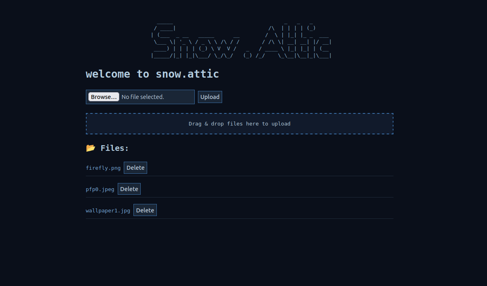

# ❄️ snow.attic

  
A minimalist file server built in Python using Flask.



## 🔐 Features

  
- Password login (stored in .env)

- Upload, download, and delete files for anywhere in the world (NGROK)

- EXTREMELY simplistic

- Drag-and-drop web interface

- Optional public URL via ngrok

  

## ⚙️ Setup

Get NGROK token from https://dashboard.ngrok.com/signup

```bash
wget https://github.com/tempdev-bit/snow.attic/archive/refs/heads/main.zip -O snow-attic.zip
unzip snow-attic.zip
cd snow.attic-main
chmod +x setup_script.sh
./setup_script.sh
```
  
After running setup_script it will automaticallly ask you if you want to run the server.
If you want to run it later:

```
cd snow.attic-main
source venv/bin/activate
python3 server.py

```
Click on the link produced by NGROK

  

## GENERAL

  

- All files are saved in uploads/ on your local machine.
- Public Access (via ngrok)
- If NGROK_AUTHTOKEN is set, the server will print a public http URL you can share.

  
  

<center><sup>Built with ❤️ by Solar<sup><center>

